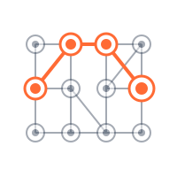

<p align="center">
  
</p>

# Object-Graph Navigation Language - OGNL

[](https://github.com/orphan-oss/ognl/actions/workflows/maven.yml)
[](https://maven-badges.sml.io/sonatype-central/ognl/ognl/)
[](https://sonarcloud.io/summary/new_code?id=orphan-oss_ognl)
[](https://sonarcloud.io/summary/new_code?id=orphan-oss_ognl)
[](https://bestpractices.coreinfrastructure.org/projects/6490)
[](http://www.apache.org/licenses/LICENSE-2.0.html)

## Note

I recently renamed the `master` branch into the `main` branch. If you previously cloned this repository please
perform locally update of your clone using the procedure described in [Updating a local clone after a branch name changes](https://docs.github.com/en/repositories/configuring-branches-and-merges-in-your-repository/managing-branches-in-your-repository/renaming-a-branch#updating-a-local-clone-after-a-branch-name-changes).

## Description

OGNL stands for Object-Graph Navigation Language; it is an expression language for getting and setting 
properties of Java objects. You use the same expression for both getting and setting the value of a property.

The `ognl.Ognl` class contains convenience methods for evaluating OGNL expressions. You can do this in two stages, parsing 
an expression into an internal form and then using that internal form to either set or get the value of a property;
or you can do it in a single stage, and get or set a property using the String form of the expression directly.

OGNL started out as a way to set up associations between UI components and controllers using property names. As the desire 
for more complicated associations grew, Drew Davidson created what he called KVCL, for Key-Value Coding Language, egged 
on by Luke Blanshard. Luke then reimplemented the language using ANTLR, came up with the new name, and, egged on by Drew, 
filled it out to its current state. Later on Luke again reimplemented the language using JavaCC. Further maintenance 
on all the code is done by Drew (with spiritual guidance from Luke).

We pronounce OGNL as a word, like the last syllables of a drunken pronunciation of "orthogonal."

 - [Language Guide](docs/LanguageGuide.md)
 - [Developer Guide](docs/DeveloperGuide.md)
 - [Version Notes](docs/VersionNotes.md)

## Apache Commons OGNL project

Sometimes ago this project has been migrated to [Apache Commons](http://commons.apache.org/ognl/) 
with a plan to maintain it there. Right now that project is considered dead and not actively maintained. There is
no plans to release a new version under Apache Software Foundation umbrella and all the future development will happen here. 

## Commercial Support

The project maintaners are working with Tidelift to provide commercial support and invest paid working time in the improvement of the projects. 
For more information, visit the [Tidelift resources](https://tidelift.com/subscription/pkg/maven-ognl.ognl?utm_source=maven-ognl.ognl&utm_medium=referral&utm_campaign=enterprise) regarding OGNL.

## Contributing

If you would like to start contributing to this project please follow the following guidelines:
- [Finding ways to contribute to open source on GitHub](https://docs.github.com/en/get-started/exploring-projects-on-github/finding-ways-to-contribute-to-open-source-on-github)
- [First-contributions project](https://github.com/firstcontributions/first-contributions)

Even the smallest contribution makes sense, like improving code formatting, fixing a typo documentation. Do not hesitate
to ask or report an issue.

## FAQ
 - How to define an AccessMember?
   - the best way is to implement your own `AccessMember` which will suite your project best, you can base on existing
     [DefaultAccessMember](src/test/java/ognl/DefaultMemberAccess.java) and adjust it to your needs.
     Since version 3.2.16 there is `AbstractAccessMemeber` which can be used a start point for your own implementation,
     see the example below:
     ```
        MemberAccess memberAccess = new AbstractMemberAccess() {
            @Override
            public boolean isAccessible(Map context, Object target, Member member, String propertyName) {
                int modifiers = member.getModifiers();
                return Modifier.isPublic(modifiers);
            }
        };
     ```
 - How to use the latest SNAPSHOT version?
   - Define OSS Sonatype repository in `~/.m2/settings.xml` as follows:
     ```xml
     <settings>
         <servers>
         ...
         </servers>
         <profiles>
             <profile>
                 <id>local</id>
                 <activation>
                     <activeByDefault>true</activeByDefault>
                 </activation>
                 <repositories>
                     <repository>
                         <id>oss-snapshots</id>
                         <url>https://oss.sonatype.org/content/repositories/snapshots/</url>
                         <layout>default</layout>
                         <snapshots>
                             <enabled>true</enabled>
                         </snapshots>
                     </repository>
                 </repositories>
             </profile>
         </profiles>
     </settings>
     ```
     and now you can use SNAPSHOT version of OGNL in your project,
